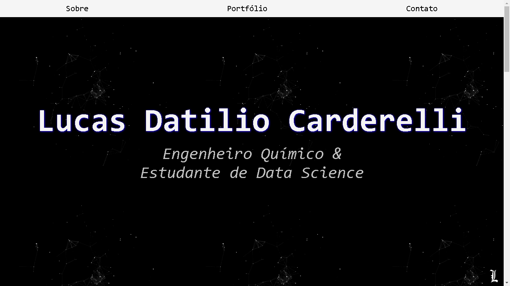

 

# MYSITE
Meu site pessoal para portifólio e contato.
  
Esse site foi criado durante a imersãoCSS da alura, aproveite e acesse para saber mais!
 
link: https://lucasdatiliocarderelli.github.io/mysite/
  
Uma previa a seguir:
 

 
## Extra
Essa pagina contem um link JS do analytics, e foi possivel visualizar a quantidade de acesso durante a semana.
 

